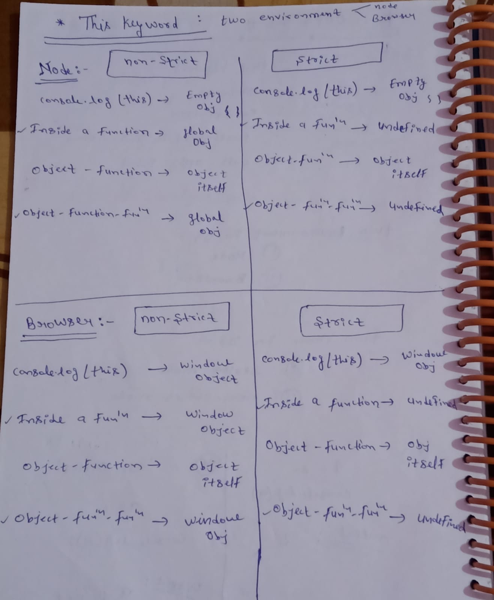

# oops in js
## this 
         In js , the this keyword refers to an object.

##### Note:
         the this keyword is not associated with arrow function.

### Two enviroment in js

- Node
- Browser

### Two mode in js

- strict mode
- non-strict mode

### IMAGE 

 

 ### Learn tricks:
- Inside a fun || obj-> fun-> fun 
      
       given same output in node n browser ::::
       
       IN non-strict : global obj replce by window obj
                     : ( node me : global obj , browser me : window obj ) bola jata h , dono same h

       IN strict - undefined

-  obj-> fun

       return obj itself in all browser,node(strict,non-strict)

 -  console.log()    
              
        node (strict,non-strict) :  empty obj 
        browser (strict,non-strict) : window obj
      

## Node : non-strict mode

### (i) 
        console.log(this);
     
####   output:   
               { }  - empty object

### (ii) Inside a function     

      function fn(){
          console.log(this)
      } 

####   output:   
               object[global]

### (iii) Inside a function Inside an object (obj -> fun)

        let obj = {
            name : "shashi",
            fn:function(){
                console.log(this)
            }
        }

        obj.fn()

####   output:   
               {name:"shashi" , fn:[function]}  - return an object itself

### (iv) obj -> fun -> fun

      let obj = {
          name:"shashi",
          f: function(){
              function g(){
                  console.log(this)
              }
              g()
          }
      }

     obj.f() 

####   output:   
              object[global]

## Node : strict mode

### (i)   
         "use strict"

         console.log(this)

####   output:   
              { }  - empty object

### (ii)  "Inside a function" with strict mode

         "use strict"

         function fn(){
             console.log(this)
         }

####   output:   
              undefined

### (iii)  obj -> fun
       
       "use strict"

       let obj = {
           name:"shashi",
           fn:function(){
               console.log(this)
           }
       }

       obj.fn()

####   output:   
              
              {name:"shashi",fn:[function]} - object itself

### (iv)  obj -> fun -> fun

     "use strict"

     let obj = {
         name:"shashi",
         fn:function(){
             function g(){
                 console.log(this)
             }
             g()
         }
     }

    
       obj.fn()

####   output:   
              
              undefined

## Browser : non-strict mode

### (i) 
        console.log(this);
     
####   output:   
 ##### on console : 
                    window obj

### (ii) Inside a function     

      function fn(){
          console.log(this)
      } 

####   output:   
                window obj

### (iii) obj -> fun

        let obj = {
            name : "shashi",
            fn:function(){
                console.log(this)
            }
        }

        obj.fn()

####   output:   
                object itself

### (iv) obj -> fun -> fun

      let obj = {
          name:"shashi",
          f: function(){
              function g(){
                  console.log(this)
              }
              g()
          }
      }

     obj.f() 

####   output:   
               window obj

## Browser : strict mode

### (i)   
         "use strict"

         console.log(this)

####   output:   
               window obj

### (ii)  "Inside a function" with strict mode

         "use strict"

         function fn(){
             console.log(this)
         }

####   output:   
              undefined

### (iii)  obj -> fun
       
       "use strict"

       let obj = {
           name:"shashi",
           fn:function(){
               console.log(this)
           }
       }

       obj.fn()

####   output:   
              
              {name:"shashi",fn:[function]} - object itself

### (iv)  obj -> fun -> fun

     "use strict"

     let obj = {
         name:"shashi",
         fn:function(){
             function g(){
                 console.log(this)
             }
             g()
         }
     }

    
       obj.fn()

####   output:   
              
              undefined

===============================================================================================================================================================================================================================================================================

### this keyword with arrow fun :
        
-        this keyword is not associated with arrow function
         (arrow fun ka this se lena dena nhi h)

-      arrow fun strict and non-strict dono k sath {} - empty obj deta h
           
          
          
           let test = () => {
                console.log(this)
            }   
            test()
            
            
            # output:    { }

-      this , it refers to its parent scope
       
       (agar aap regular fun k ander arrow fun banate h , 
       toh arrow fun , regular fun ki properties ka access le lega)
       i.e parent ki properties ko access kar lega

        
        let person = {
            name:"shashi",
            age:26,
            showDetails : function(){
                console.log(this.name +''+this.age)

                let arrFun = () =>{
                    console.log(this.name+''+this.age)
                }
                arrFun()
            }

        }

        person.showDetails()
        
        
        # output :
                 shashi 26
                 shashi 26

        
        Note: 
              showDetails fun k pas this.name , this.age ka access hai ,
              toh showDetails k ander jo arrow fun bna h uska child huaa, 
              toh uske pas bhi access mil jayega. 
              (this ka arrow se koi lena dena nhi h)

-          
   
          let person ={
              name:"shashi",
              age:26,
              shoDetails : function(){
                  console.log(this.name+''+this.age)
              },
              arrFun: ()=>{
                  console.log(this.name+''+this.age)
              }
          }

          person.showDetails()
          person.arrFun()

          
          
          # output:
                   shashi 26
                   undefined undefined
                 

                    

- 
       
        let name = vikash,
        let age = 23
        
        let person = {
            name:"shashi",
            age:26,
            showDetails : function(){
                console.log(this.name +''+this.age)

            },
            let arrFun1 = () =>{
                console.log(this.name+''+this.age) 
            }
            
             let arrFun2 = () =>{
                console.log(name+''+age)
            }

        }

        person.showDetails()
        person.arrFun1()
        person.arrFun2()

       
       
        # output:
                  shashi 26
                  undefined undefined
                  vikash 23

           
