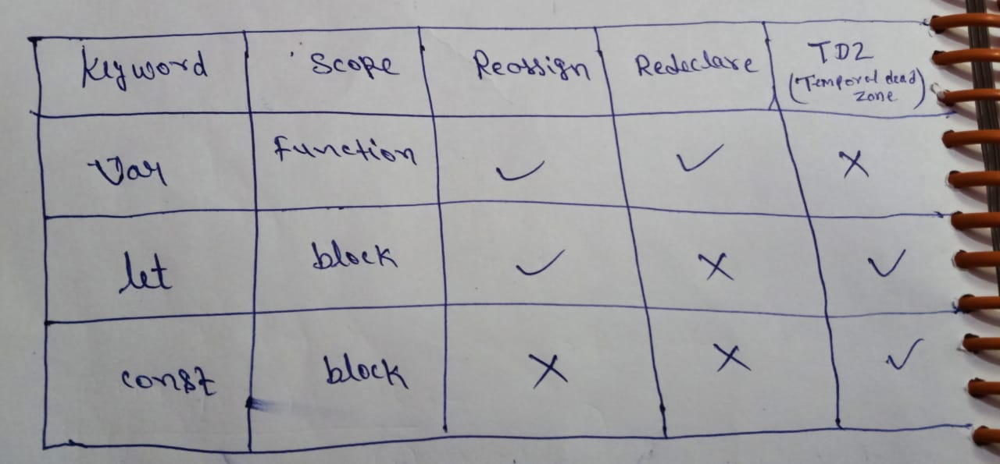

# var , let , const 

## var : 
     var a ; // declaration

     a = 2 ; // initialization

     var a = 3 ; // both initialization & declaration

     (eg)
          var a;
          console.log(a) // undefined

      (eg) 
            var a = 3
            console.log(a)

            var a = 'i am a string'
            console.log(a)

            # output :
                       2
                       i am a string

### js is a
- loosely typed language || dynamically typed language || weekly typed language
  
 
- js is a dynamically typed language, dataType is not specified here
 
 
  means :
         
         jha hme type define nhi karna hota , hmm kisi bhi variable prr koi bhi value dal sakte h ,
         use hmm dynamically typed language kahte h 

-  (eg)
        
         var a ;
         console.log(a)

         a=3;
         console.log(a)

         var a = true
         console.log(a)

         var a = null 
         console.log(a)

         # output:
                   undefined

                   3

                   true

                   null      

### var has some problems  
- Re-declaration
- Scoping

##### First problem with var - Re-declaration

- (eg)
       
       var b = 'hello'
       
       var b = 'bye' //re-declare
       
       console.log(b)

       # output: 
                 bye
     
      
- overcome Re-declaration :

    
      use let keyword 

      let b = 'hello'
      console.log(b)

      let b = 'bye' 
      console.log(b)

###### output:
             
             error - Identifier b has already been declare

### note:

          let me re-declare nhi krr sakte par "re-assign" krr sakte h

          (eg)

                let b = 'hello'
                console.log(b)

                b='bye'
                console.log(b)

                # output :

                            hello
                            bye              

##### Second problem with var - Scoping

- (eg)
                   
         if(10%2==0){
             var a = 2
             console.log(a)
        }
        
        console.log(a)
      
      
       # output :
                  2

                  2

- var keyword is function scoped , let & const is block scoped

   
   
      if(10%2==0){
          let a=2
          console.log(a) //2
      }
      console.log(a) // error

      # output:
                2

                error - a is not defined

## const
         
         const ko na toh re-assign kar sakte h aur na hi re-declare

- (eg)
        
        const a = 2 // declaration & initialization sath-2 krna hota h const me
        console.log(a)

        # output:
                  2

- (eg)
      
      const a = 2

      a=30 // re-assigning is not allowed

      const a = 'i am a string'   // re-declaration is not allowed
       

### var vs let vs const

